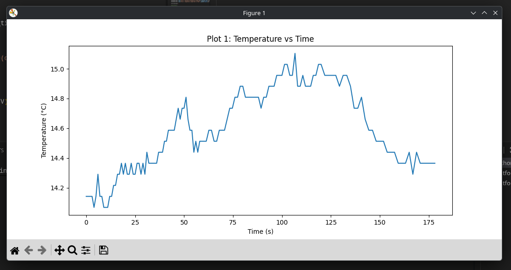
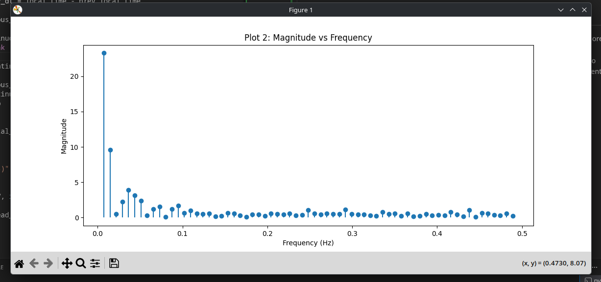
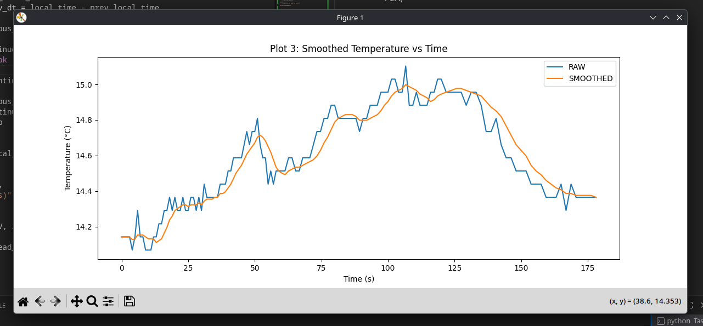
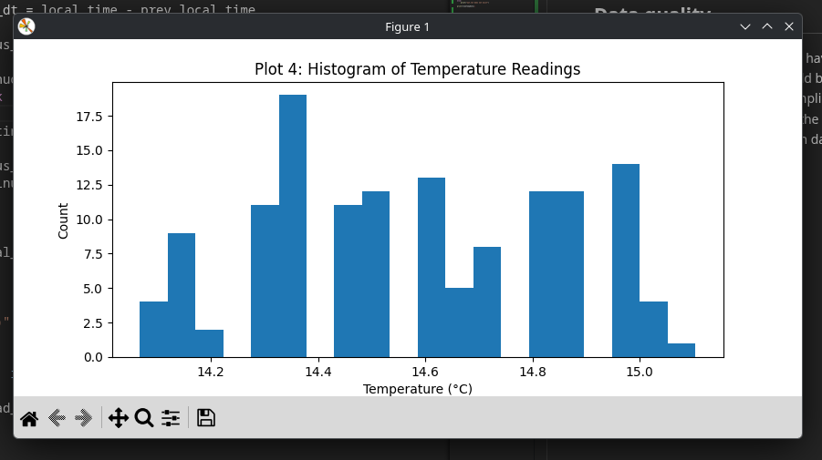
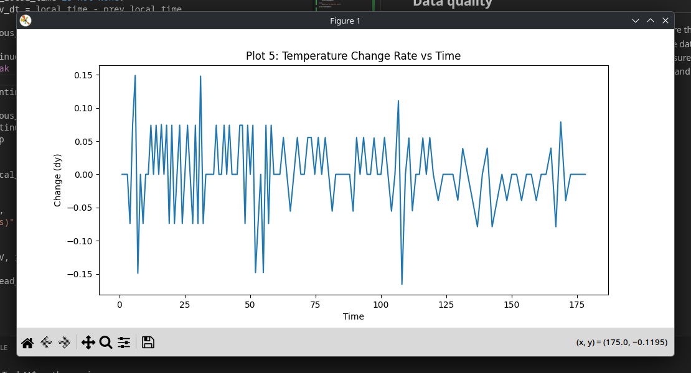

src code: [%PROJECT_ROOT%/Task4/src/main.cpp](./src/main.cpp)

# Plot 1: Temperature vs Time
## Picture

this picture shows the graph produced by matplotlib using python

## What does this graph show?
- This graph shows that the temperature over time has not been stable, it increases slowly for ~100 seconds and later reducing shqrply between 100-150 seconds and levels off for the remainder of the time.
- A significantly spike can be seen at ~50 seconds quickly rising from 25.5oC to just below 28oC before dropping down to 26oC. 
- There appears to be a very faint amount of noise within the certain part of the signal such as (20-30 seconds and ~160 seconds).
- When the sensor is cooling at 130 seconds it creates a shape that resembles a staircase but is pretty smooth.

---
# Plot 2: Magnitude vs Frequency

this picture shows the graph produced by matplotlib using python for the task requiring to graph magnitude vs frequency.

## What does this graph show?
This graph shows that the sample used is very low-frequency dominated, and that there are lots of low-frequency oscillations. The lackthereof high-frequency magnitude in the graph, shows visually that there is no high-frequency noise in this sample. The dominant frequency for this sample is around 0.055Hz. However there is a few small peaks in frequencies like ~0.430 and ~0.295

---
# Plot 3: Smoothed Temperature vs Time

this picture shows the graph produced by matplotlib using python for the task requiring to graph both the raw and smoothed temperature vs time samples.

## What does this graph show?
The smoothing of the grapth makes the change in temperature appear a little later but it shows that any large spikes in the temperature curve out the peak into a more stable looking temperature. the trend still shows an increase in temperature then follows a decay towards the end of the test. 

---
# Plot 4: Histogram of Temperature Readings

this picture shows the graph produced by matplotlib using python for the task requiring to graph a histogram of the temperature values.

## What does this graph show?
- the most common temperature value was 14.35oC.
- A the temperature was well spread out. that shows all temperature was shown equaly on the graph.

---
# Plot 5: Temperature Change Rate vs Time

---
# Discussion of Findings
## Time-domain behaviour
- The temperature was increasing slowly overtime then decreased towards the end. 
- The large rise in temperature occured at around 45 seconds. 
- The signal did not appear to be significantly noisy visually can be see at 25 seconds and 165 seconds. 

## Frequency-domain behaviour
- The component with the highest frequency component appears to be component 1 ~ 0.056Hz.
- The graph shows that it was low-frequency dominant.
- The dft shows that there is only low frequency patters that it recognised. 
- As the magnitude for higher-frequency was almost 0, this indicates that there was almost no high-frequency noise in the sample used. except for minute peaks at ~0.295Hz and ~0.430Hz

## System Behaviour 
- the temperature was changing very slowly and as it stayed between 1 degree for the duration of the 3 minute test the system decresed the sampling rate from 1Hz at the beginning of the test to 0.5Hz towards the end of the test to conserve on its power draw.
- to imporve upon the system i could ensure that there is more data used for calculations. and ensuring that it is also more power efficient.

## Data quality
- the recording duration could have been extended to ensure that the data is more accurate, but also there would be no issue with storing the data. 
- I believe that that rate of sampling was appropriate, to ensure that it wasnt too frequent that it would flood the UART with too much data and not too infrequent that there wouldnt be anouth data to analyze. 

